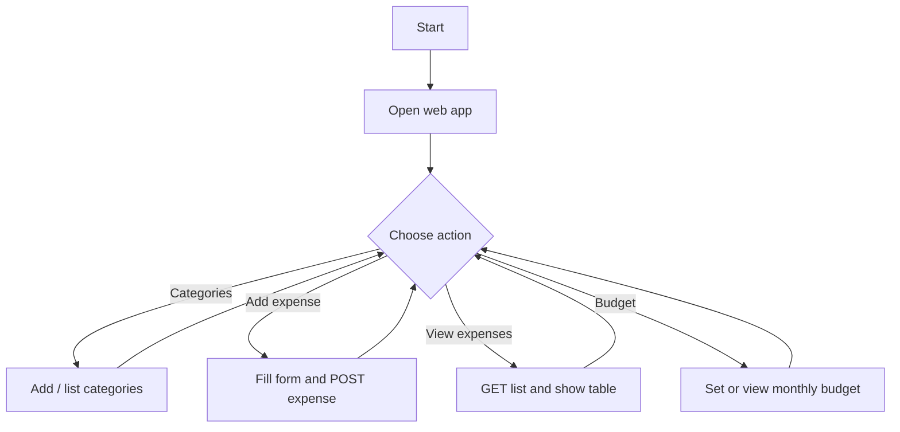
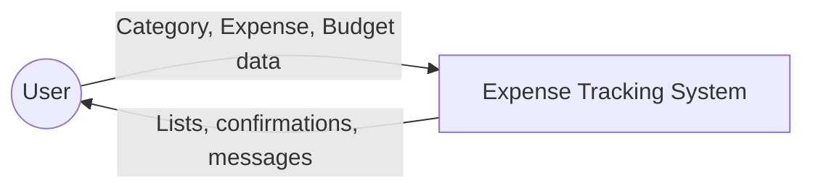
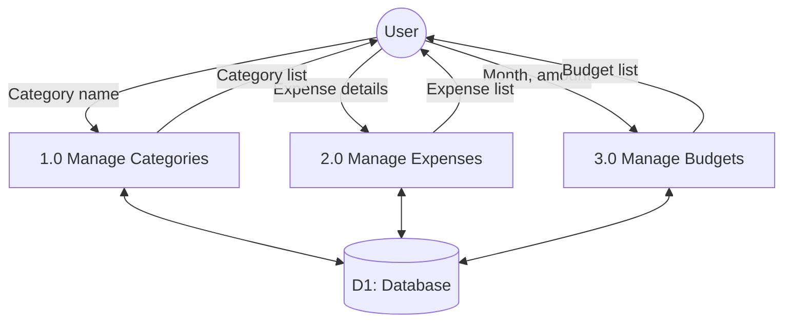
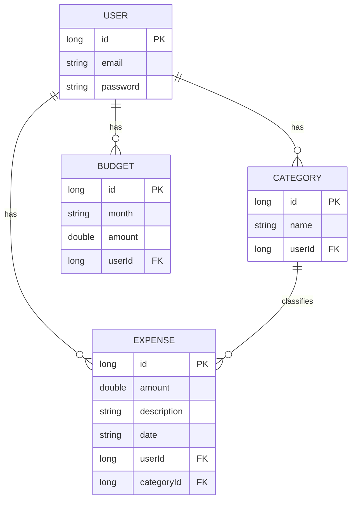

# Chapter 3 — System Analysis & Design (Workflow, ERD, DFD, I/O Design)

## 3.1 Overall System Workflow (Narrative)

1. User opens the **web application** in a browser (e.g. `http://localhost:8080`).  
2. User navigates to **Categories** and **adds** one or more category names.  
3. User goes to **Add expense**, enters **amount, description, date**, selects **category**, and **saves**.  
4. The browser sends a **POST** request to `/api/expenses` with JSON; the **controller** saves via **JPA repository**.  
5. User opens **View expenses**; the app **GET**s `/api/expenses?userId=1` and fills the table.  
6. User may open **Budget**, choose a **month** and **amount**, and **POST** to `/api/budget`.

---

## 3.2 High-Level Flowchart (User Flow)

> **For Word:** Redraw in **Visio / draw.io** or use the flow below as a guide.

---

## 3.3 Data Flow Diagrams (DFD)

### 3.3.1 Context diagram (Level 0)

*One process: Expense Tracking System; external entity: User.*

### 3.3.2 Level-1 DFD (simplified)

*Processes: P1 Manage categories, P2 Manage expenses, P3 Manage budgets; Store: D1 Database.*

> **Viva note:** In Word, you may use **Gane-Sarson** or **Yourdon/DeMarco** notation if your course prefers; label data stores and flows with names.

---

## 3.4 Entity–Relationship Diagram (ERD) — Conceptual

### 3.4.1 Description

- **User** has many **Category**, many **Expense**, and many **Budget** (via `userId`).  
- **Expense** references one **Category** (via `categoryId`).  
- **Budget** is per **user** and **month** (month stored as a string, e.g. `YYYY-MM`).

### 3.4.2 Diagram (Mermaid ER-style)

> Export as image for Word if your version does not render Mermaid.

*Adjust attribute names to match your actual `User` entity in code if it differs (only include fields you actually implemented).*

---

## 3.5 Input / Output Screen Design

| Screen / Section | Inputs | Outputs |
|------------------|--------|--------|
| **Add expense** | Amount, description, date, category (dropdown) | Success message, summary line (count/total) |
| **View expenses** | (Optional filter via userId in code) | Table: date, category, amount, description |
| **Categories** | New category name | Pills / list of categories |
| **Budget** | Month (YYYY-MM), amount | List of saved budgets |

**UI principles used:** Sticky top navigation, clear section labels, form labels above fields, error/success text for feedback, responsive layout considerations.

---

## 3.6 Processing (Backend)

- **Controller** layer validates and maps JSON to **entity** objects.  
- **Repository** layer (`JpaRepository`) performs **insert and select** operations.  
- **Hibernate** generates **SQL** at runtime (`ddl-auto=update` in development) to keep tables aligned with entities.  

*Insert 1 short paragraph on your chosen `userId` scoping in repository queries (if implemented) for the exam.*

---

*Include **screenshot placeholders** in Word: `Fig 3.1 – Home / Add Expense`, `Fig 3.2 – View Expenses`, etc.*
